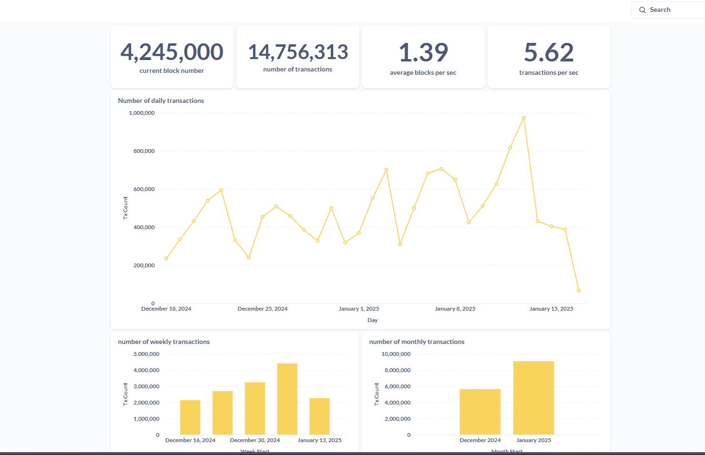
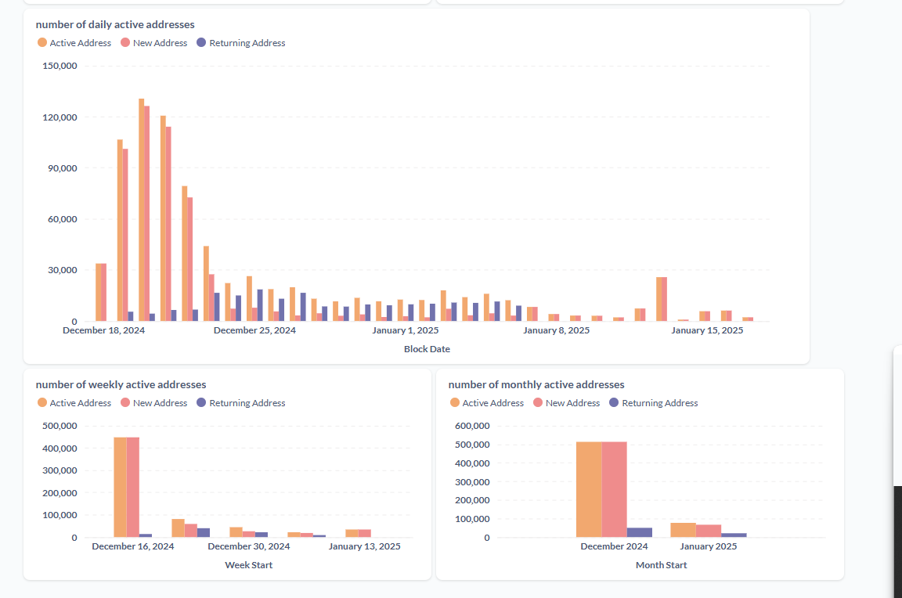

Welcome to your new dbt project!

### Using the starter project

Try running the following commands:
- dbt run
- dbt test

Run the following commands to initialise the .env file
 `set -a; source .env; set +a`
 `dbt debug --profile chain_dbt_models --target prod`

if you are running this on windows wsl. Follow this approach to create the .env file

```
cat > .env << 'EOL'
CLICKHOUSE_DEV_PASSWORD=""
CLICKHOUSE_DEV_SCHEMA=""
CLICKHOUSE_DEV_HOST=0.0.0.0
CLICKHOUSE_DEV_PORT=1234
CLICKHOUSE_DEV_USER=""
CLICKHOUSE_PROD_SCHEMA=""
CLICKHOUSE_PROD_HOST=0.0.0.0
CLICKHOUSE_PROD_PORT=1234
CLICKHOUSE_PROD_USER=""
CLICKHOUSE_PROD_PASSWORD=""
EOL
```
then run
`set -a; source .env; set +a`
`dbt debug --profile chain_dbt_models --target prod`

This should work for windows


### Dashboard
The screenshot below shows the dashboard built from the current models in this repository. The development of these models will follow an iterative approach and more insights will be added to this dashboard while the projects continues to grow.




### Resources:
- Learn more about dbt [in the docs](https://docs.getdbt.com/docs/introduction)
- Check out [Discourse](https://discourse.getdbt.com/) for commonly asked questions and answers
- Join the [chat](https://community.getdbt.com/) on Slack for live discussions and support
- Find [dbt events](https://events.getdbt.com) near you
- Check out [the blog](https://blog.getdbt.com/) for the latest news on dbt's development and best practices
